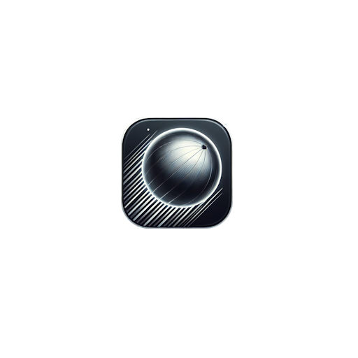
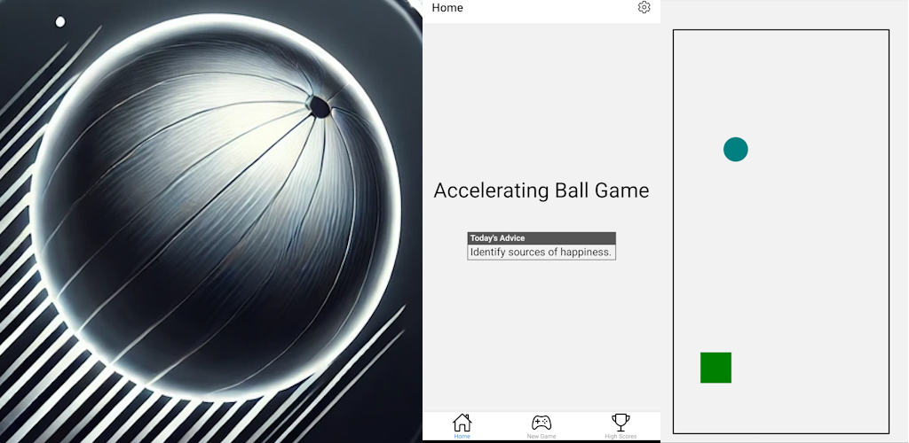
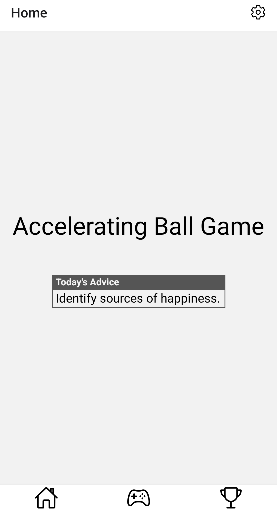
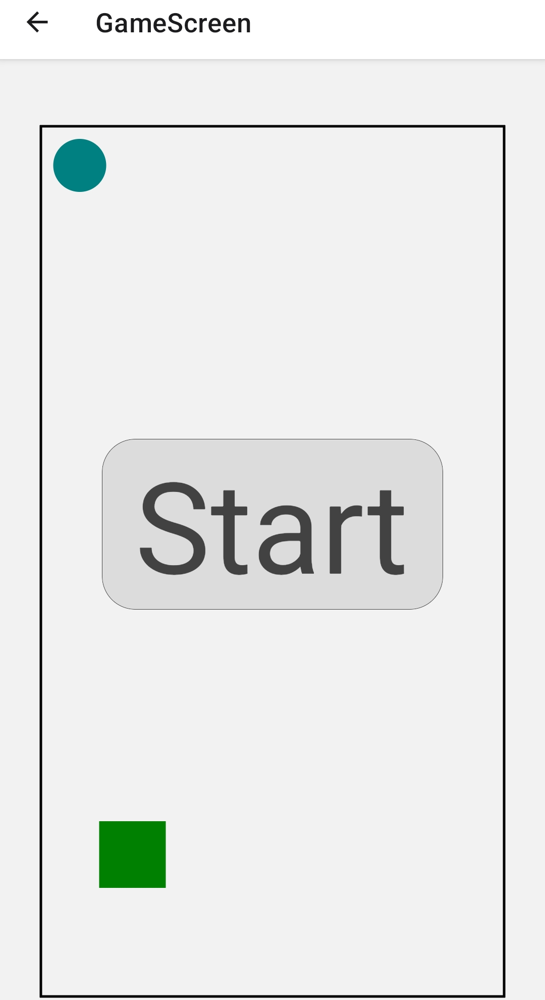
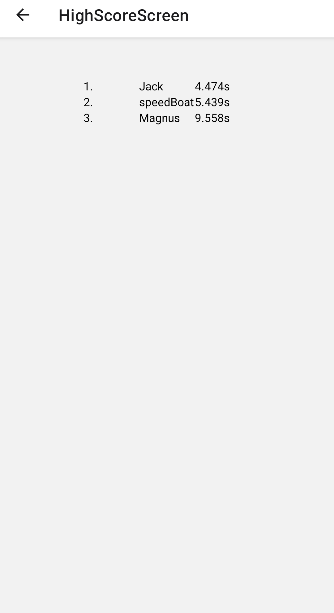
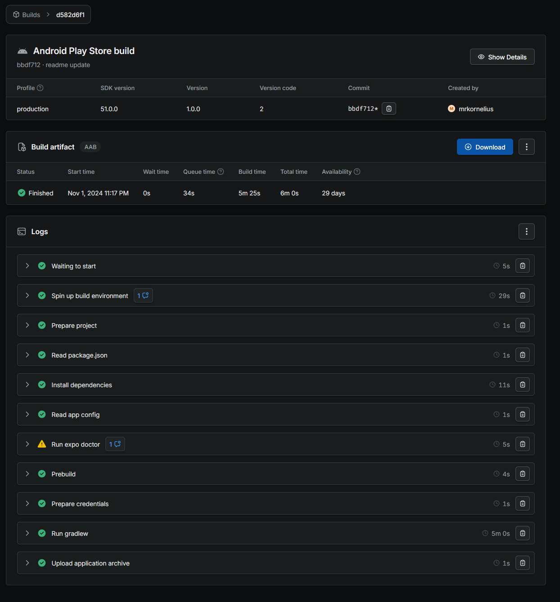

# Inlämningskrav för VG

## Inlämning

Lägg in den här filen i rooten av ditt projektet. Se sedan till att lägg till bilder andra filer som behövs i projektet också och uppdatera länkarna nedan i det här dokumentet.

När du är klar zippar du ihop projektet (utan node_modules) och lämnar in inlämningen på nytt i Google Classroom.

**OBS: Öppna den här filen som preview så du ser att dina länkar är rätt. Om bilder inte visas så kommer VG kompletteringen inte att godkännas.**

## Förbered appen

Utöver det som ska anges i den här filen så ska du även lägga till en appikon och en splashscreen i [app.json](./app.json) filen samt eventuella andra inställningar om du har använt dig av exempelvis kameran eller GPS'en, den informationen finns dokumenterad för respektive modul i Expo referensen.

**Det här måste göras innan du bygger appen.**

## Skyltfönstret i butiken & Bygga appen.

Nu kan du bygga appen med EAS och ladda hem filen när den är klar. Fyll sedan i nedanstående uppgifter som bevis på att du bara är några få steg ifrån att lansera din applikation på butiken.

**Applikationens Namn:**
Accelerating Ball Game

**Kort Beskrivning (max 80):**
Styr en boll genom att luta mobilen i rätt riktning i detta enkla och fartfyllda spel! Med hjälp av mobilens accelerometer rör sig bollen dit du vill. Utmana dig själv och förbättra dina tider för att nå målzonen, som sparas i en personlig topplista. Varje spelstart bjuder dessutom på “dagens råd” för en inspirerande upplevelse.

**Fullständig Beskrivning (max 4000):**
Accelerating Ball Game är ett spel där du styr en boll genom att luta mobilen i den riktning du vill att bollen ska accelerera. Detta sker med hjälp av mobilens inbyggda accelerometer, vilket ger en dynamisk spelupplevelse där du helt styr med handens rörelser.

Appen inkluderar en topplista som visar dina bästa tider för att nå målzonen. Topplistan är enhetsbaserad och sparas lokalt, vilket gör att du enkelt kan följa dina framsteg över tid. Vid behov kan topplistan rensas i inställningarna.

Varje gång du startar appen, möts du av “dagens råd” – en visdom eller uppmuntran som hämtas online och uppdateras regelbundet via en extern server. Detta ger en unik, personlig touch till din spelupplevelse!

Applikationens ikon och laddningsbild.

[Läs mer om dessa bilder här](https://docs.expo.dev/develop/user-interface/splash-screen-and-app-icon/).

En omslagsbild som visas på olika ställen i butiken.

Två till åtta fönsterbilder i formatet 16:9 eller 9:16 samt bredd och höjd mellan 320 och 3840 px.

[Binärfilen](./application-d582d6f1-6051-43be-b063-36dba6d7a318.aab)

Tänk på att bilden måste visa både "Created By" och "Start Time".
